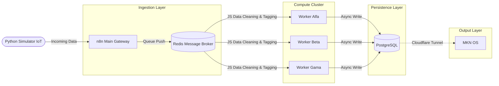
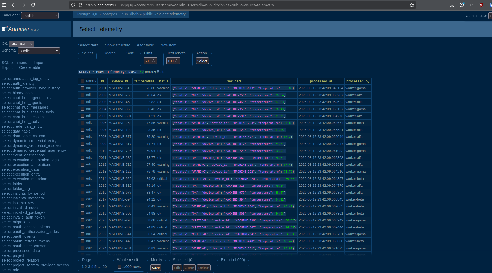

# Industrial-Grade Data Ingestion Pipeline (PoC)

### Overview
This repository contains a Proof of Concept (PoC) I built, that demonstrates a scalable, fault-tolerant data ingestion pipeline. I built this to handle high-volume telemetry data spikes—such as IoT sensor reads or bulk ERP migrations—without crashing the main application or dropping critical payloads.

This architecture evades relying on a direct webhook to database communication, and instead uses a decoupled queue system built on n8n, Redis, and PostgreSQL, monitored by a real-time Streamlit dashboard.

## Architecture Design

<table>


</table>

<table>
  <tr>
    <td>
      
    </td>
  </tr>
</table>

The design focuses on three core principles:

* **Decoupling & Backpressure Management:** The main n8n instance acts strictly as an API Gateway. It receives incoming webhooks, immediately pushes the payloads into a Redis queue, and returns a `200 OK` to the client. This keeps the gateway fast and prevents timeouts during massive traffic spikes.
* **Horizontal Scalability:** Data transformation and database writes are processed asynchronously by a cluster of isolated worker nodes (Alfa, Beta, Gama). If the ingestion volume grows, scaling is as simple as spinning up additional worker containers.
* **Fault Tolerance:** If the PostgreSQL database slows down or a worker container crashes, the ingestion process doesn't break. Incoming data remains safely stored in the Redis message broker until a worker is healthy and ready to process it.

### Tech Stack
* **Workflow Automation & Workers:** n8n (Configured in `EXECUTIONS_MODE=queue`)
* **Message Broker:** Redis
* **Relational Database:** PostgreSQL
* **Telemetry Dashboard:** Python + Streamlit
* **Infrastructure:** Docker & Docker Compose
* **Network / Tunneling:** Cloudflare Tunnels (for remote dashboard access)

### Quick Start (Running Locally)

### Prerequisites
If you want to run this project you would need Docker and Docker Compose installed on your machine.

### 1. Clone the repository
```bash
git clone [https://github.com/yourusername/your-repo-name.git](https://github.com/yourusername/your-repo-name.git)
cd your-repo-name
```
